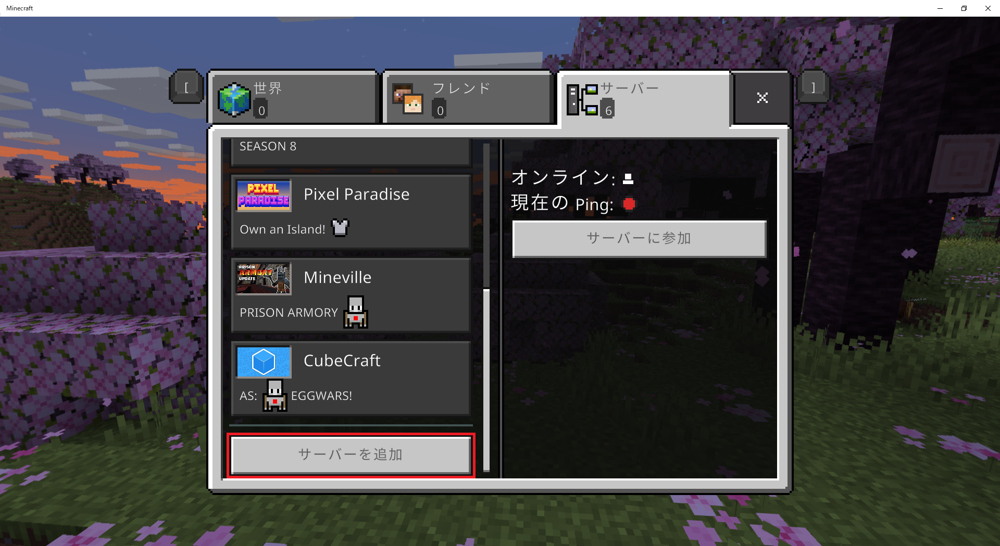

# README
## INDEX
- [Commands](#Commands)
- [How to connect multi server](#How-to-connect-multi-server)

## BEFORE YOU START
- ドメイン取得済み
- AWSに登録済み

## Commands
### Build terraform and docker container command
```bash

./script.sh init_local false
# EC2の環境構築までwait
sleep 300
./script.sh init_ec2

# サーバーの初期化を確認
./script.sh ssh
sudo docker logs mc_server
```

### MCRCON command note
```bash
./script.sh rcon
```

```rcon
list
say
time set day
weather clear
```

### TODO after restart EC2 instance
```bash
# EIP未設定のため、起動の度にIPが変わる
cd tf/
terraform apply
./output_dump.sh

cd ../
./script.sh ssh
sudo docker logs mc_server
```

### Backup to local command
```bash
./script.sh bak
```

### Backup restore command
```bash
./script.sh restore world-<yyyyMMdd-hhmmss>.tgz
```

### EC2インスタンスの手動制御
以下のメンテナンスを行う
- Route53のAレコード削除/作成
- EC2インスタンスの停止/起動

#### STOP EC2
```bash
aws lambda invoke --function-name control_ec2_instance --cli-binary-format raw-in-base64-out --payload '{"Action": "Stop"}' out
```

#### RESTART EC2
```bash
aws lambda invoke --function-name control_ec2_instance --cli-binary-format raw-in-base64-out --payload '{"Action": "Start"}' out

cd tf/
terraform apply
./output_dump.sh
cd ..
```


<br><br><br><br><br>

## How to connect multi server
- [Java Edition](#Java-Edition)
- [Bedrock Edition (統合版)](#Bedrock-Edition-統合版)
- [Switch Edition](#Switch-Edition)

### Java Edition
1. ランチャーを起動
  

1. 起動構成を新規作成
  

1. 名前とバージョンを指定
  ※ バージョンは、知らされたサーバーのMINECRAFT_VERSIONに合わせること
  

1. 作成した起動構成で起動
  

1. 起動した画面で「マルチプレイ」メニューを選択
  

1. 「サーバーを追加」を選択
  

1. サーバー名とアドレスを指定
  ※ アドレスは、知らされたEC2インスタンスのパブリップIPアドレス、または構築されたサブドメインに合わせること
  

1. サーバーに接続
  

1. マルチプレイサーバーに参加
  

<br><br><br><br><br>

### Bedrock Edition (統合版)
1. ランチャーを起動し、ゲームも起動
  

1. 「遊ぶ」を選択
  

1. 「サーバー」タブを選択
  

1. リストを一番下までスクロールして「サーバーを追加」を選択
  

1. サーバー名とアドレスを指定して保存
  ※ アドレスは、知らされたEC2インスタンスのパブリップIPアドレス、または構築されたサブドメインに合わせること
  

1. 追加したサーバーを選択し、「サーバーに参加」を選択
  

1. マルチプレイサーバーに参加
  

<br><br><br><br><br>

### Switch Edition
1. 「設定」を選択
  

1. 「インターネット設定」を選択
  

1. 有線/無線から接続している方法を選択し、「設定の変更」を選択
  

1. DNS設定を変更
  ※ 優先DNS: 104.238.130.180, 代替DNS: 008.008.008.008
  

1. SwitchでMinecraftを起動し、任意のサーバーに参加する
  

1. 画面が色々遷移した後に「Connect to a Server」を選択
  

1. サーバー名とアドレスを指定して送信
  ※ アドレスは、知らされたEC2インスタンスのパブリップIPアドレス、または構築されたサブドメインに合わせること
  

<br><br><br><br><br>
